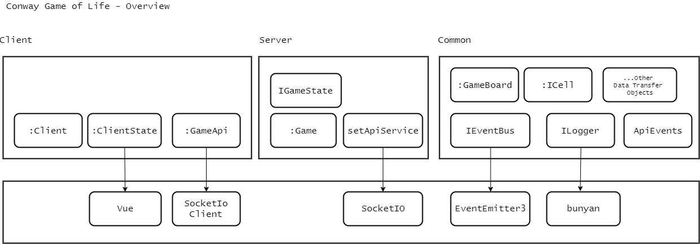
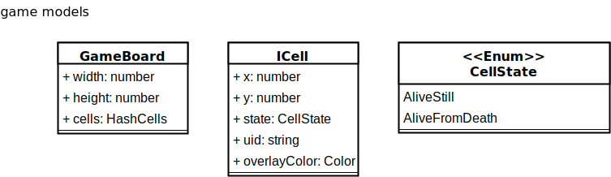
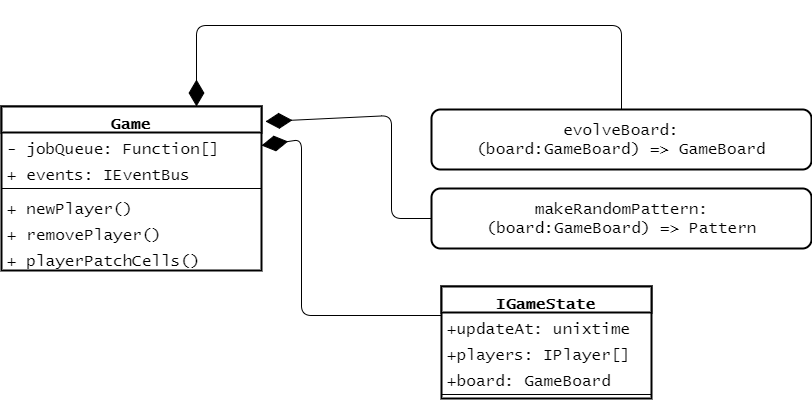
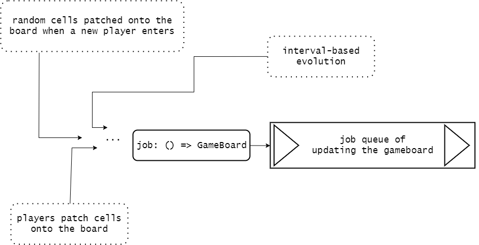
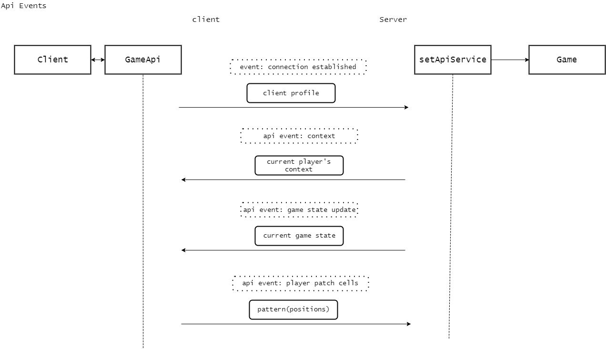

# Multi-player Conway's Game of Life

This is a web-based game: Conway's Game of Life, developed as the specification at https://hackmd.io/s/SyXikdg_g#full-stack--backend-developer--eng-manager

## Built With

* [express](https://expressjs.com/) - Web server
* [socket-io](https://socket.io/) - widely used lib for real time connection
* [Vue](https://vuejs.org/) - Front end framework
* [Typescript](https://www.typescriptlang.org/index.html) - static type checkings
* [mocha](https://mochajs.org/) - testing framework
* [Webpack](https://webpack.js.org/) - front end assets bundling

## Deploy to Heroku

#### The Automated way

A heroku account is required.

[](https://heroku.com/deploy)

#### The Manual way

You must have a heroku account and a heroku CLI installed. See https://devcenter.heroku.com/articles/heroku-cli

```sh
git clone https://github.com/victor-develop/conway-gof.git
cd conway-gof
heroku create
heroku push master
```
And then check out the web url provided in the console.

## Local-machine development

### Prerequisites

To run this game locally, you should have Docker installed. You can download and install from https://www.docker.com/get-docker

At the time of development I am using version `17.09.0` on Windows machine. Docker should work aross different platforms


### Getting Started

#### The first time of use

- Clone the repository and enter the directory root

  ```sh
  git clone https://github.com/victor-develop/conway-gof.git
  cd conway-gof
  ```
- Run Docker

  ```sh
    docker-compose up -d
  ```
- Enter the bash of the docker image

  ```sh
    docker-compose exec conway /bin/bash
  ```
- You shall be at the /home/dev now. The `package.json` at root directory is __NOT__ the package.json for this project. This is just a file created for Heroku's requirement to deploy the app successfully. Instead, you should go to `solution` folder to see the real package.json, where the project source code stays.

- Install npm dependencies

  ```sh
    cd solution
    npm install
  ```
- start the server

  ```sh
    // still at `solution` directory
    npm run dev
  ```

  Now you can go to `localhost:8080` and start playing the game. To try out multi-players just open another browser window

#### local development
Enter the shell with

```sh
docker-compose exec conway /bin/bash
cd solution
```

And then, in the bash shell, you may:
 - __run tests__: 

  ```sh
    npm run test
  ```

 - __development with live-reload server__: 
 
  ```sh
    npm run dev
  ```


## Implementation Details

#### Directory Structure

The source code is mostly under `./solution/ts_code/`, divided into 3 major parts: __client__, __common__, and __server__, which will be transpiled into JS under `./solution/dist/` with corresponding folder structure.

##### The `dist/client/static`

Webpack will also transplie and place a bundled front-end `base.bundle.js` into `dist/client/static`.  __HOWEVER__, The `./solution/dist/client/static` is __NOT only__ a folder for transpliled content, but also some static assets like __index.html, .js, .css__ and so on. These are legacy files which are not yet integrated into the bundling process. It is not a good practice to mix genereted files and source files together, so these static assests may probably be moved out from `dist` and get packed into webpack bundle sometime later.

```sh

./                          # config of docker, webpack, nodemon, typescript, tslint, etc.
├─.vscode                   # vscode debug config
├─docker
│  └─docker-image
└─solution                  # source code and compiled/transpiled files
    ├─dist                  # mainly contains files transpiled from ./solution/ts_code
    │  ├─client
    │  │  ├─static          # NOTE: The 'static' files contains static content which need not transpliling
    │  ├─common
    │  └─server
    ├─node_modules
    └─ts_code               # Typescript source code
        ├─client            # client-side code, running in browsers
        │  ├─src
        │  └─tests
        ├─common            # reusable components/classes for both front and back ends
        │  ├─src
        │  └─tests
        └─server            # server-side code, running in Node.js
            ├─src
            │  ├─config     # project configurations
            └─tests

```

#### Application Architecture

This is not a strict UML but a rough conceptual overview of the whole application.



As in the diagram, 
  - `common` includes data models, interfaces, events, and utitlities, e.g. logger that are shared by both front&back ends.
  - `client` contains front end logic. __Vue__ is used as the reactive presenter of __:ClientState__, which is part of __:Client__, __:GameApi__ takes care of communication with server, and coordinates with __:Client__ through events.
  - `server` 's main component is the __:Game__ instance, the function __setApiService__ handles communication with clients and manipulate the __:Game__ instance accordingly

The real time connection is currently implemented with __SocketIO__, but can also be replaced with other solutions if needed in the future, by changing the __GameApi__ at the client-side and __setApiService__ at the server-side, without affecting other components.

#### Core components

##### GameBoard
GameBoard is esstially a list of __alive__ cells (pratically, arranged in hash map but not list) plus the world border: width and height. Dead cells are not stored, but they will be stored once they come back to life according to reproduction rule. Cells are arranged in (0,0)-started 2-d grid plain.



##### evolveBoard
A function that takes a board as input and output a "evolved" board with lists of cells updated.

##### Game



The __Game__ class at server side broadcast its state to clients via api service whenerver updated. Ideally, the game board can be updated by evolution or manually updated by players at any time. But it would be complex and hard to debug if the game board is being updated by evolution and by user at the same moement. Thus, the __Game__ internally uses a queue to avoid muting the game state concurrently. Any update logic to the board will be packed in a funtion and queued up, and the board will be updated sequentially according to queue order. The __Game__ keeps scanning and consuming the job queue every 10 milleseconds, making it feeling reactive in players' experience. The following diagram shows different things happened which will enqueue an update function.



To enable easier testing and debug, the following items were intentionally designed as injected dependencies of the constructor of __Game__ .(below only list some arguments important to note, for full list of argumrents required plz See __./solution/ts_code/server/game-engine/game.ts -> constructor()__)

  - `evolveFunc: (board: GameBoard) => GameBoard`: the logic of natural evolution
  - `getRandomPattern: (board: GameBoard) => Pattern`: random pattern generator,it can be mocked with a function which returns known pattern series during testing
  - `eventBus: IEventBus`: mainly used to broadcast game state updates
  - `evolveTimer: IIntervalLoopSetter`: an interface that does similar function as native JS `setInterval`, by mocking this object, you can manually control how and when the board updates during testing
  - `jobQueueTimer: IIntervalLoopSetter`: an interfae that does similar function as native JS `setInterval`, by mocking this object, you can decide the behaviour of how and when a update-board job is dequeued and consumed during testing

By using these injection you can simulate a completely predicatable test against the state changes of the game board. See `./solution/ts_code/server/tests/set-api-service.spec.ts`

#### Events

Different components depend on `IEventBus` to coordinates with each other. Theses files defined the event keys:

 - `apiEvents`: ./solution/ts_code/common/src/api/api-events
 - `socketEvents`: ./solution/ts_code/common/src/api/socket-events

The major events happened between server and clients is shown below (error events omitted):



#### Logging
This project used [bunyan](https://github.com/trentm/node-bunyan) for logging implementation of the `ILogger` interface. It can be replaced with other solutions as well if needed in future.

 - In development environment it will output everything to the `stdout`. 

 - During tests it will output logs to `./solution/dist/server/tests/ouput_xxxxx.txt` depending on the datetime at runtime.

The whole application starts with one root level logger, and different places in the application may spawn a child logger by using `logger.child(customKey: string)`, and all the json output by the child logger will have the property __customKey__ you can track with.


All the event buses, as well as socket-io in the application should be already attached with a logger by `./solution/common/src/log-event-bus.ts`. Every time when an event, e.g. `apiEvents.gameStateUpdate` is registerd with a handler or emmited, the event will be automatically logged as well as the arguments passed through. You can easily track the application on your heroku deployment by redirecting `heroku logs` to you own disk. You can also use some json search and filter techniques provided by [bunyan cli](https://github.com/trentm/node-bunyan#cli-usage)

__Note__: bunyan logger just automatically appended a word 'undefined' at 'msg' fields of each log, this is not an application error.

For example, a root level log is like this

```javascript
{"name":"Development Log","hostname":"6a6b14989f8f","pid":464,"level":30,"msg":"listening on 8080 undefined","time":"2017-12-26T07:41:16.694Z","v":0}
```

And a child logger by spawned by `logger.child('apiService - socketio')`  looks like this, as you can see it has a property named `apiService - socketio`. This is a sample log when a handler is registered(mounted) on the __error__ event.

```javascript
{"name":"Development Log","hostname":"6a6b14989f8f","pid":464,"apiService - socketio":"apiService - socketio","level":30,"eventKey":"error","msg":"event mounted on 1514274076702","time":"2017-12-26T07:41:16.702Z","v":0}
```

And here is another sample log when the event __game-state-update__ is emitted.

```javascript
{"name":"Development Log","hostname":"6a6b14989f8f","pid":464,"level":30,"eventKey":"game-state-update","args":[{"updateAt":1514274121728,"players":[{"uid":"S1h76OkXf","name":"Plaki","color":"#a5c359"}]}],"msg":"event emitted 1514274121728","time":"2017-12-26T07:42:01.728Z","v":0}
```

## Versioning

  [SemVer](http://semver.org/) is used for versioning. 

## TODOs

  - __common/src/api/__`apiEvents` contains keys representing client->server and server->client, better to sepearate them in later versions.
  - __dist/client/static__: Move it somewhere else and copy it into `dist` at build time, so that `dist` can be a directory purely for built artifacts.
  - at client side, `Client` is calling `GameApi` and vice versa, they depended on each other, but things can be simpler, `Client` does not need to know anything about `GameApi`, but just has to simply expose its methods to `GameApi`, then `GameApi` will call `Client` according to different events. By doing so `Client` does not depend on `GameApi` anymore. Bi-directional dependency becomes one way. That's actually what I already did at server side, `Game` does not know anything about the api object, in fact there is not even a real class named `ApiService`, just used the function `setApiService` to set tup the `Game`'s behaviour according to different events.
  - currently the board is bordered and cannot have negative coordinates. But the `evolveBoard()` function CAN support borderless evolution argrithmatically. What else needed is to implement a board which can dynamically shrink and enlarge its width and height according to the cells it has, of course then the client intereface should also support world-exploring feature.
  - better error messages to players
  - a log reader to organize and present the logs nicely
  - For production environment, use `pm2` to restart process in case of exit, and add health monitor like [appmetrics](https://github.com/RuntimeTools/appmetrics)


## License

This project is licensed under the MIT License - see the [LICENSE.md](LICENSE.md) file for details

## Acknowledgments

Credits to below, where I adapted/learnt from their code for

Drawing game board
 - Codebyte: https://coderbyte.com/tutorial/create-a-simple-chessboard-using-html-css-and-jquery

Reference for setting up the project structure and environment
* Rising Stack: https://blog.risingstack.com/building-a-node-js-app-with-typescript-tutorial/

* luixaviles: 
https://github.com/luixaviles/socket-io-typescript-chat

Readme Template
* PurpleBooth: https://gist.github.com/PurpleBooth/109311bb0361f32d87a2